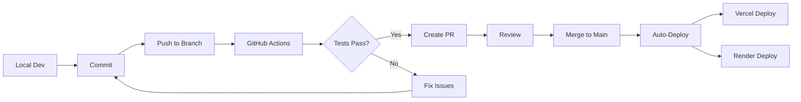

# CI/CD Pipeline Setup Guide

Complete guide for setting up Continuous Integration and Continuous Deployment.

---

## 📦 What's Included

### GitHub Actions (`.github/workflows/ci.yml`)
- ✅ Frontend TypeScript type checking
- ✅ Frontend build validation
- ✅ Backend Python syntax checking
- ✅ Backend import validation
- ✅ Dependency verification
- ✅ Automated on every push/PR

### Vercel Integration
- ✅ Auto-deploy on push to `main`
- ✅ Preview deployments for PRs
- ✅ Environment variable management
- ✅ Build caching
- ✅ Edge caching

### Render Integration
- ✅ Auto-deploy on push to `main`
- ✅ Health check monitoring
- ✅ Zero-downtime deployments
- ✅ Auto-scaling (paid plans)
- ✅ Persistent disk support

---

## 🚀 Quick Setup

### 1. Enable GitHub Actions

GitHub Actions are **automatically enabled** when you push the `.github/workflows/ci.yml` file.

Check status:
1. Go to your repository on GitHub
2. Click "Actions" tab
3. You should see workflows running

### 2. Set Up Vercel

```bash
# Install Vercel CLI
npm install -g vercel

# Login
vercel login

# Link project (from frontend directory)
cd frontend
vercel link

# Set environment variables
vercel env add NEXT_PUBLIC_API_URL production
# Enter: https://your-backend.onrender.com

# Deploy
vercel --prod
```

**Enable Auto-Deploy:**
1. Go to Vercel Dashboard → Your Project
2. Settings → Git
3. Ensure "Automatically deploy" is enabled for `main` branch

### 3. Set Up Render

**Option A: Using Blueprint (Recommended)**

1. Push `render.yaml` to your repo
2. Go to Render Dashboard
3. New → Blueprint
4. Select your repository
5. Render auto-configures from `render.yaml`
6. Set secret environment variables:
   - `APIFY_API_TOKEN`
   - Update `ALLOWED_ORIGINS` with your Vercel URL

**Option B: Manual Setup**

1. New → Web Service
2. Connect repository
3. Configure as per DEPLOYMENT.md
4. Enable auto-deploy

---

## 🔧 Configuration Files

### `.github/workflows/ci.yml`
GitHub Actions workflow for automated testing.

**Triggers:**
- Push to `main`, `develop`, or `claude/**` branches
- Pull requests to `main` or `develop`

**Jobs:**
1. **frontend-check**: TypeScript, linting, build
2. **backend-check**: Python syntax, imports, dependencies
3. **deployment-status**: Summary (only on main)

### `vercel.json`
Vercel deployment configuration.

**Key Settings:**
- `buildCommand`: Custom build command
- `outputDirectory`: `.next` directory
- `env`: Environment variables
- `headers`: Security headers
- `redirects`: API proxy (optional)

### `render.yaml`
Render service configuration.

**Key Settings:**
- Service type, region, plan
- Build and start commands
- Environment variables
- Health check path

---

## 🔐 Environment Variables

### Required for Vercel (Frontend)

| Variable | Value | Notes |
|----------|-------|-------|
| `NEXT_PUBLIC_API_URL` | `https://your-backend.onrender.com` | Backend API URL |

**Set via CLI:**
```bash
vercel env add NEXT_PUBLIC_API_URL production
```

**Or via Dashboard:**
Settings → Environment Variables → Add

### Required for Render (Backend)

| Variable | Value | Secret? | Notes |
|----------|-------|---------|-------|
| `APIFY_API_TOKEN` | Your Apify token | ✅ Yes | From Apify dashboard |
| `ALLOWED_ORIGINS` | `https://your-frontend.vercel.app` | No | Your Vercel URL |
| `EXPORT_FOLDER` | `/tmp/exports` | No | Must be set |

**Set in Render:**
Dashboard → Service → Environment → Add Environment Variable

---

## 🔄 Workflow

### Development Flow



### Deployment Flow

```bash
# 1. Make changes
git add .
git commit -m "feat: add new feature"

# 2. Push to branch (triggers CI)
git push origin feature/my-feature

# 3. GitHub Actions run automatically
#    - TypeScript check
#    - Python syntax check
#    - Build validation

# 4. Create PR
gh pr create --title "Add new feature" --body "Description"

# 5. After review, merge to main
gh pr merge --squash

# 6. Auto-deploy triggered
#    - Vercel deploys frontend (~2 min)
#    - Render deploys backend (~3 min)
```

---

## 🧪 Testing CI/CD

### Test GitHub Actions

```bash
# Push to any branch
git push origin your-branch

# Check status
gh run list

# View logs
gh run view <run-id>
```

### Test Vercel Deploy

```bash
# Deploy preview
vercel

# Deploy to production
vercel --prod

# Check deployment
vercel ls
```

### Test Render Deploy

```bash
# Trigger manual deploy
# Dashboard → Service → Manual Deploy → Deploy Latest Commit

# Or push to main
git push origin main

# Check logs
# Dashboard → Service → Logs
```

---

## 🐛 Troubleshooting

### GitHub Actions Failing

**Frontend type errors:**
```bash
# Run locally
cd frontend
npm run type-check

# Fix errors and commit
```

**Backend syntax errors:**
```bash
# Run locally
cd backend
python -m py_compile main.py
python -c "from main import app"

# Fix errors and commit
```

### Vercel Deploy Failing

**Build errors:**
```bash
# Check Vercel logs
vercel logs <deployment-url>

# Test build locally
cd frontend
npm run build
```

**Environment variable missing:**
```bash
# Verify variable is set
vercel env ls

# Add if missing
vercel env add NEXT_PUBLIC_API_URL production
```

### Render Deploy Failing

**Build errors:**
Check Render logs in dashboard

**Import errors:**
Ensure all files are committed:
```bash
git status
git add <missing-files>
git commit -m "Add missing files"
git push
```

**Environment variable errors:**
Check that all required variables are set in Render dashboard

---

## 📊 Monitoring

### GitHub Actions
- **Status**: Repository → Actions tab
- **Logs**: Click on any workflow run
- **Notifications**: Settings → Notifications → Actions

### Vercel
- **Deployments**: Dashboard → Deployments
- **Analytics**: Dashboard → Analytics
- **Logs**: Click deployment → Function Logs

### Render
- **Status**: Dashboard → Service
- **Logs**: Dashboard → Service → Logs (live stream)
- **Metrics**: Dashboard → Service → Metrics

---

## 🎯 Best Practices

### 1. Always Test Locally First
```bash
# Frontend
cd frontend
npm run type-check
npm run build

# Backend
cd backend
python -c "from main import app"
```

### 2. Use Semantic Commit Messages
```bash
git commit -m "feat: add bot detection"
git commit -m "fix: resolve export error"
git commit -m "docs: update README"
```

### 3. Create Feature Branches
```bash
git checkout -b feature/new-feature
# Make changes
git push origin feature/new-feature
# Create PR
```

### 4. Review CI Logs
Always check GitHub Actions logs before merging PRs

### 5. Monitor Production
- Check Render logs after deploy
- Test API health endpoint
- Verify frontend loads correctly

---

## 🔒 Security

### Secrets Management

**Never commit:**
- API keys
- Tokens
- Passwords
- `.env` files

**Use environment variables:**
- Vercel: Dashboard → Settings → Environment Variables
- Render: Dashboard → Environment
- GitHub: Repository → Settings → Secrets

### CORS Configuration

Always update `ALLOWED_ORIGINS` when you get a new Vercel URL:
```bash
# In Render dashboard
ALLOWED_ORIGINS=https://your-frontend.vercel.app,http://localhost:3000
```

---

## 📈 Performance Optimization

### Frontend (Vercel)

1. **Enable caching** (already configured in `vercel.json`)
2. **Use Edge Functions** for API routes (optional)
3. **Enable Analytics** (Vercel Dashboard)

### Backend (Render)

1. **Use Workers** (currently 2, increase if needed)
2. **Enable Persistent Disk** for exports (paid plans)
3. **Monitor response times** in Render metrics

---

## 🎓 Advanced Configuration

### Custom Domain

**Vercel:**
1. Dashboard → Settings → Domains
2. Add domain → Follow DNS instructions

**Render:**
1. Dashboard → Settings → Custom Domain
2. Add domain → Update DNS

### Database Integration

Add to `render.yaml`:
```yaml
databases:
  - name: reviews-db
    databaseName: reviews
    user: reviews_user
    plan: free
```

### Caching with Redis

Add to `render.yaml`:
```yaml
services:
  - type: redis
    name: reviews-cache
    plan: free
```

---

## 🆘 Getting Help

- **GitHub Actions**: [Documentation](https://docs.github.com/actions)
- **Vercel**: [Documentation](https://vercel.com/docs)
- **Render**: [Documentation](https://render.com/docs)

---

## ✅ Checklist

Before pushing to production:

- [ ] All tests passing locally
- [ ] GitHub Actions workflow exists
- [ ] Vercel project connected
- [ ] Render service created
- [ ] All environment variables set
- [ ] CORS configured correctly
- [ ] Health checks passing
- [ ] Documentation updated
- [ ] Secrets secured
- [ ] Monitoring enabled

---

## 🎉 You're All Set!

Your CI/CD pipeline is now fully configured!

Every push to `main` will:
1. ✅ Run automated tests
2. ✅ Build both frontend and backend
3. ✅ Deploy to Vercel (frontend)
4. ✅ Deploy to Render (backend)
5. ✅ Verify deployments

Happy deploying! 🚀
